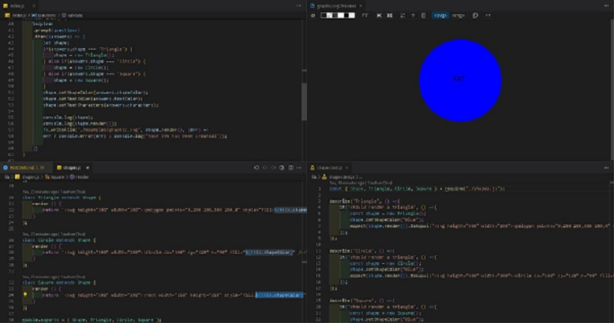

# Graphic-Maker

## Description

This is a project using jest and inquirer to create SVG graphics for web developers to bypass needing a graphic artist. You use the command line prompts to generate an image based on

your needs!

## Table of Contents

- [Installation](#installation)
- [Usage](#usage)
- [Credits](#credits)
- [Tests](#tests)

## Installation

In order to run this make sure your dependencies for inquirer and jest are functional by using npm i in your terminal. Inquirer is version 8.2.4, and jest is ^24.9.0.

## Usage

After you have the modules installed, use the command node index.js to bring up the prompt and create your SVG graphic.

link to demo video: https://drive.google.com/file/d/1MZdK2Oz6-VWELb4hR9ucRTW433YDXKtk/view

## Credits

- AskBCS
- Juno Nguyen, tutor.

## Tests

Tests were run with the shapes.test.js file, using jest. Feel free to test it yourself!
